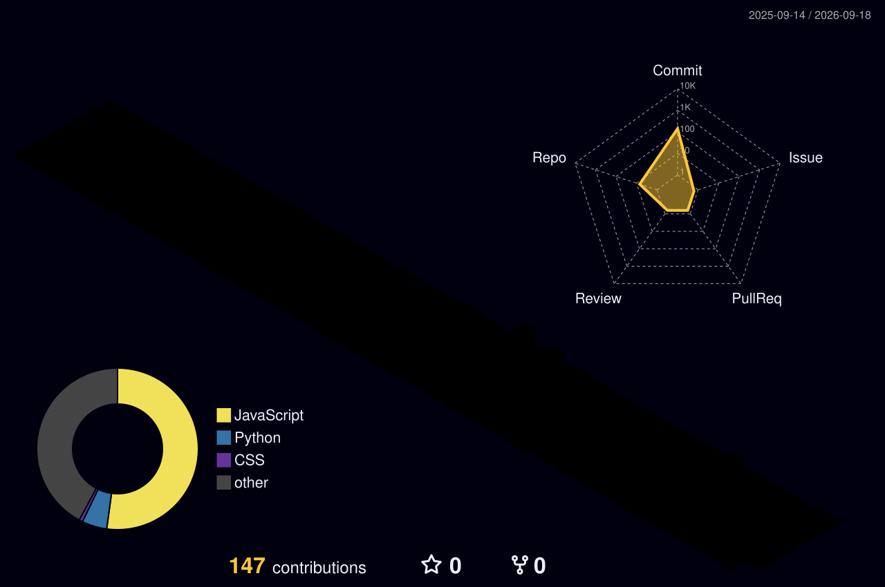

  

  

  

---

### 🤖 About Me
- 🎓 **B.Tech (2nd Year)** @ VIT-AP University
- 🚀 Founder of **Nexra Technologies**
- 💼 Passionate about **Startups, Innovation & Building Scalable Businesses**
- 🛠️ Tech Stack: **Python, SQL, React, Next.js, Tailwind CSS**
- 💡 Building **Servify One** [Servify One](https://servify-one.onrender.com/) — One App. All Warranties. Instant Repairs.

---

## 🚀 Featured Projects

<table>
<tr>

<td width="50%" valign="top">

### 🔧 <a href="https://servify-one.onrender.com/">Servify One</a>

**One App. All Warranties. Instant Repairs.**

A startup-focused platform that digitizes warranties, simplifies service requests, and connects users with verified technicians.

**Tech Stack**

`Node.js` `Express` `MongoDB` `JavaScript` `Startup`

</td>

<td width="50%" valign="top">

### 🏏 <a href="https://ipl-auction-v3ih.onrender.com/">IPL Auction Game</a>

**Real-Time Multiplayer IPL Auction Simulator**

A professional IPL auction platform where users create auction rooms, bid on players in real time, manage team budgets, and experience live cricket auctions with a modern gaming UI.

**Tech Stack**

`JavaScript` `Node.js` `Socket.io` `Real-Time` `Gaming`

</td>

</tr>

<tr>

<td width="50%" valign="top">

### 🧭 <a href="https://tirumala-smart-navigation.netlify.app/">Tirumala Smart Navigation System</a>

**AI Navigation for Crowded Environments**

A smart navigation solution designed to reduce congestion inside temples using optimized routing and intelligent guidance.

**Tech Stack**

`Navigation` `Optimization` `AI` `Smart System`

</td>

<td width="50%" valign="top">

### 🤖 <a href="https://pardha05-trading-analizer.hf.space/">AI Trading Pattern Analyzer</a>

**AI-Powered Stock Pattern Detection**

A deep learning application that analyzes stock charts, detects technical patterns, and generates intelligent trading insights.

**Tech Stack**

`Python` `YOLOv8` `Machine Learning` `FinTech`

</td>

</tr>
</table>

---

## 📊 GitHub Activities

<!-- Languages + Commits Graph -->
 

  

 

<!-- Streak -->

  

## 📊 Contribution Analytics

  

  
  

### 🐍 Contribution Snake

  

## 📈 3D Contribution Graph

  

---

### 🤝 Let's Connect

## 💫 Thanks for Visiting

  

